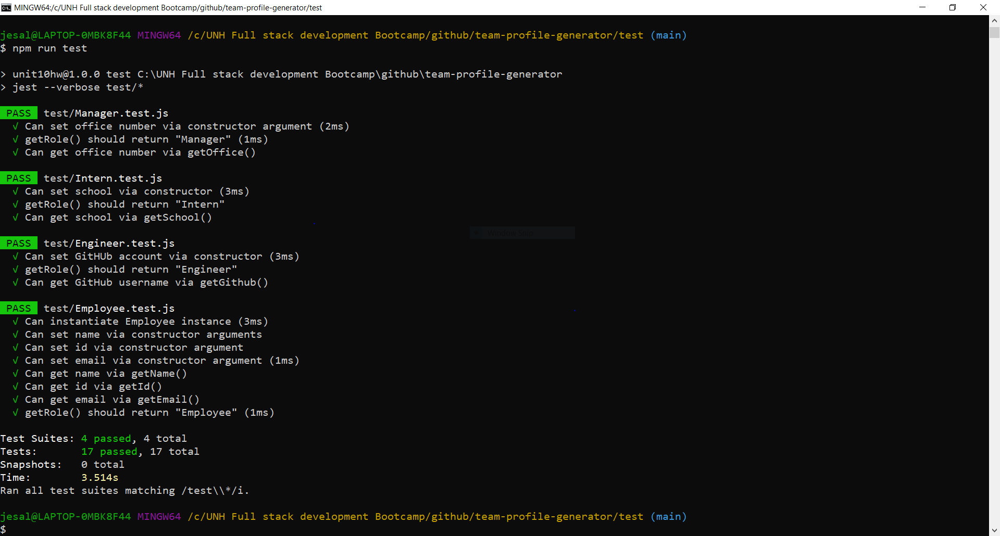
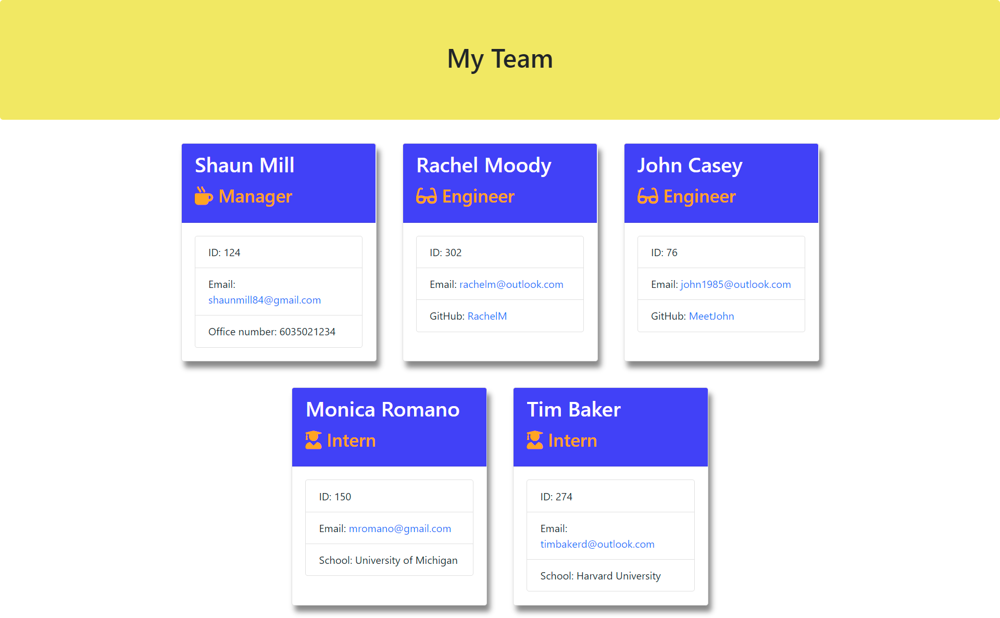

# team-profile-generator
Team-Profile-Generator using inquirer package  
[](https://opensource.org/licenses/MIT)

## User Story
```
As a manager
I want to generate a webpage that displays my team's basic info
so that I have quick access to emails and GitHub profiles
```
## Description
This is a node command-line application that can be used to gather information and generate a software engineering team profile. The application will prompt the user for information about the team which includes the manager as well his team members. The user can input any number of team members, and they may be a mix of engineers and interns. When the user has completed building the team, the application will create an HTML file that displays a nicely formatted team roster with summaries of each person based on the information provided by the user.

This ```team.html``` file is generated dynamically from user's input using the [Inquirer package](https://www.npmjs.com/package/inquirer). 

Application Development: 
[Inquirer npm package](https://github.com/SBoudrias/Inquirer.js/) has been used to prompt the user for details like name, email, id, and specific information based on their role with the company. For instance, an intern may provide their school, whereas an engineer may provide their GitHub username. The different employee types all inherit some methods and properties from a base class of `Employee`.
All the unit tests have been run using `npm run test`and have passed.[jest](https://jestjs.io/) is used for running the provided tests. 
Bonuses have also been implemented:
- Used validations to ensure that the information provided is in the proper expected format.
- Added the application to my portfolio.

## Table of Contents
* [Installation](#installation)
* [Usage](#usage)
* [Contributing](#contributing)
* [Questions](#questions)
* [License](#license)

## Installation
1. Pre-requirement is to install a command-line application and node version 14.15.0 or higher.
2. Open the terminal/command-line and open the directory where the project is downloaded. 
3. Enter the command 'npm install' to install all the required package dependencies.

## Usage
1. In the command line/terminal within the directory that the project is downloaded, invoke the application using the command 'node app.js' 
2. Provide answers to the list of questions prompted.
3. When all the answers are provided, you will get a "Success!" message and a file named ```team.html``` will be generated in the newly created directory named `output` based on the responses. You can copy the file to the destination folder and rename it as you like. You can customize the styling if desired by editing the style.css within the assets folder.
4. An error will be displayed if the file generation is unsuccessful.

## Contributing
This application has been individually developed by Jesal Mehta. If you are interested in fixing issues and contributing directly to the code base, you can do so according to the guidelines listed in the [Contributor Covenant](https://www.contributor-covenant.org/) industry standard.

## Questions
For any questions,
Here is my Github profile link: [JesalDM](https://github.com/JesalDM)  
You can also reach out to me directly at [jesaldmehta@gmail.com](mailto:jesaldmehta@gmail.com)

## License
This project is licensed under the terms of the MIT license.

## For Review
* Github Repository URL: https://github.com/JesalDM/team-profile-generator
* Walkthrough video: 
    - 
    - 
    - 
* Screenshot :
   - 
   - 
* Link to sample team.html file generated: [Sample-Team-Profile](./assets/sampleTeam.html)
* Bonuses implemented:
   - Added validations to ensure that the responses are in the expected format
        
   - Added this project to my portfolio
        Portfolio URL: (https://jesaldm.github.io/portfolio/)
        Portfolio Github URL: (https://github.com/JesalDM/portfolio)
